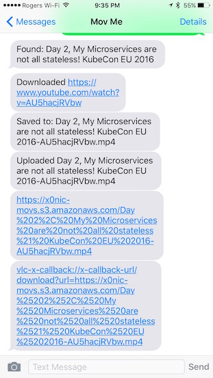
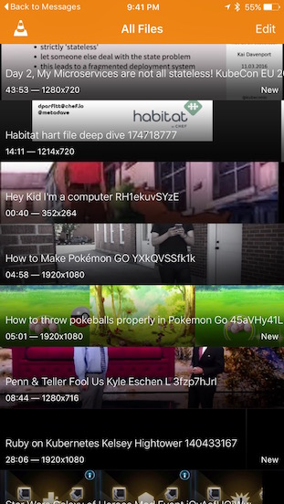

# Mov Me

An SMS chatbot that downloads videos from online sources and posts to your personal S3 bucket.

## How it Works

Once you connect the app to Twilio and pick a phone number. You will be able to SMS YouTube or Vimeo URLs, and receive an SMS back with a link.
With VLC on your phone, the video can be downloaded for offline viewing. 

## Setup

1. Install ruby
1. run `bundle install`
1. Create your own config `cp config/config.yml.example config/config.yml`
1. Enter your s3 and twilio settings into config. (More instructions to come later)
1. run `rackup`

